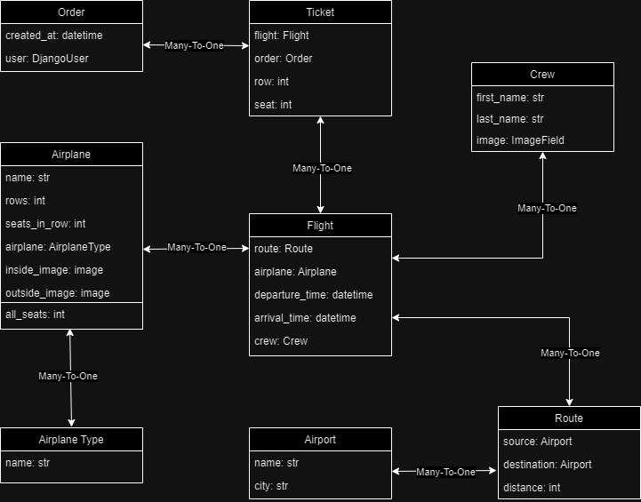

# airport-api-service

Django api-service for people who want to discover  the world

# Database Structure



# Installing using GitHub

Python3, PostgreSQL must be already install


```shell
git clone https://github.com/VladyslavOladko/airport-api-service.git
cd AirportApi
python -m venv venv
source venv/Scripts/activate
pip install -r requirements.txt
set DB_HOST=<your db host>
set DB_NAME=<your db name>
set DB_USER=<your db user>
set DB_PASSWORD=<your db password>
set SECRET_KEY=<your secret key>
python manage.py migrate
python manage.py runserver
```

# Run with Docker

Docker must be already install
```shell
docker-compose build
docker-compose up
```

## Getting access

* create user via api/user/register/
* get access token via api/user/token/

## Features

* JWT authenticated
* Admin panel /admin/
* Managing orders and tickets
* Permissions for admin and authenticated user`s
* Filtering flight and airports

## Demo


